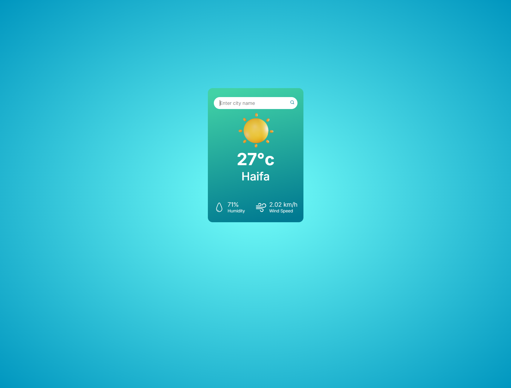

# Weather Checker 

A simple weather checking app. Just enter the name of any city to instantly see the current weather conditions.

##  Live Demo

[Visit the site](https://weather-7dh3.onrender.com/)

##  Tech Stack

- **HTML**
- **CSS**
- **JavaScript**
- **Bootstrap**
- **OpenWeather API**

## Features

- Real-time weather data based on city name
- Minimal and clean interface
- Fully responsive layout using Bootstrap

## Screenshots

### Main Page

### City Page

## 👤 Author

**Dmitriy Batrakov**  
[GitHub Profile](https://github.com/DmitryBatrakov)
